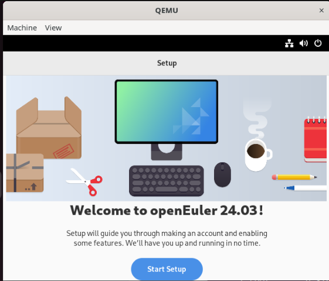

# 安装 OpenEuler 24.03 LTS SP2 RISC-V 虚拟机并部署桌面环境

使用环境：Ubuntu 24.04 LTS

## 准备工作

安装下面的依赖：

```shell
sudo apt install qemu-system-misc qemu-utils wget
```

## 安装虚拟机

进入 [OpenEuler 官网](https://www.openeuler.org/zh/download/)，找到你想下载的版本，选择 RISC-V，**Scenario/场景 选择 Cloud/云计算**（而不是服务器，只有 ISO）；要下载的文件有 `start_vm.sh` `qcow2.xz` `RISCV_VIRT_VARS.fd` `RISCV_VIRT_CODE.fd`，可以使用 `wget https://a/file1 https://b/file2` 写在一条命令的形式一次性下载好。

接下来：

- 解压虚拟机镜像：`unxz openEuler-24.03-LTS-SP2-riscv64.qcow2.xz`
- 镜像扩容：`qemu-img resize openEuler-24.03-LTS-SP2-riscv64.qcow2 +15G`
- 为脚本添加可执行权限：`chmod +x start_vm.sh`

打开 start_vm.sh，可以看到：

```shell
## Configuration
vcpu=8
memory=8
drive="$(ls *.qcow2)"
fw1="RISCV_VIRT_CODE.fd"
fw2="RISCV_VIRT_VARS.fd"
ssh_port=12055

cmd="qemu-system-riscv64 \
  -nographic -machine virt,pflash0=pflash0,pflash1=pflash1,acpi=off \
  -smp "$vcpu" -m "$memory"G \
  -blockdev node-name=pflash0,driver=file,read-only=on,filename="$fw1" \
  -blockdev node-name=pflash1,driver=file,filename="$fw2" \
  -drive file="$drive",format=qcow2,id=hd0,if=none \
  -object rng-random,filename=/dev/urandom,id=rng0 \
  -device virtio-vga \
  -device virtio-rng-device,rng=rng0 \
  -device virtio-blk-device,drive=hd0 \
  -device virtio-net-device,netdev=usernet \
  -netdev user,id=usernet,hostfwd=tcp::"$ssh_port"-:22 \
  -device qemu-xhci -usb -device usb-kbd -device usb-tablet"
```

vcpu 代表分配 CPU 核心数；  
memory 代表对虚拟机分配多少 GB 内存；  
脚本里还写当前文件夹只能有一个 `.qcow2` 文件；  

由于我们要配置桌面环境，那就删除 `-nographic`；
为了让配置虚拟机更加方便，加入 `-serial mon:stdio` 参数，代表把 serial 重定向到 stdio（而不是图形界面）。

## 启动虚拟机

执行 `./start_vm.sh`

启动的时候会卡在

```shell
[    3.101653][    T1] integrity: Unable to open file: /etc/keys/x509_evm.der (-2)`
```

这并没有卡死，而是因为内核参数有 `quiet`，日志被简化了，大概等半分钟后会输出登录提示：

```shell
openEuler 24.03 (LTS-SP2)
Kernel 6.6.0-98.0.0.103.oe2403sp2.riscv64 on an riscv64

cyan-VirtualBox login:
```

根据[官方文档](https://docs.openeuler.org/zh/docs/25.09/server/installation_upgrade/installation/risc_v_qemu.html)，用户名：`root` 密码：`openEuler12#$`

## 配置桌面环境

### 时间同步

尝试安装软件包，发现：

```shell
[root@cyan-VirtualBox ~]# dnf group install xfce-desktop
OS                                              0.0  B/s |   0  B     00:02
Errors during downloading metadata for repository 'OS':
  - Curl error (60): SSL peer certificate or SSH remote key was not OK for https://mirrors.openeuler.org/metalink?repo=24.03LTS_SP2/OS&arch=riscv64 [SSL certificate problem: certificate is not yet valid]
  - Curl error (60): SSL peer certificate or SSH remote key was not OK for https://repo.openeuler.org/openEuler-24.03-LTS-SP2/OS/riscv64/repodata/repomd.xml [SSL certificate problem: certificate is not yet valid]
Error: Failed to download metadata for repo 'OS': Cannot download repomd.xml: Cannot download repodata/repomd.xml: All mirrors were tried
```

里面的 `SSL certificate problem: certificate is not yet valid`，为关键信息。现代网络加密传输信息，以及 2FA，很大程度都依赖系统时间是否正确（偏移不太大），而看看目前镜像的时间（`date` 命令）：`Fri Jun 13 06:07:08 PM UTC 2025`，而我在写这里的时候时间为 `Tue 10 Feb 2026 02:22:57 AM CST`，差了半年多，很多证书都还没生效。

看一下系统有没有自动同步时间的机制呢？

```shell
yum list installed | grep time
yum list installed | grep ntp
yum list installed | grep chrony
```

常见的都没有。尝试了一下修改 qemu 的 `-rtc` 参数也不行。这可能是固件或者自带系统的问题。那就手动调整时间吧。

在源机器（或者自己读，说起来 Vision LLM 的 clock benchmark 远远达不到人类基线）：`date -u '+%Y-%m-%d %H:%M:%S'`  
在目标机器：`timedatectl set-time "TIME"`，如 `timedatectl set-time "2026-02-09 18:45:49"`

要自动同步时间：

```shell
yum install systemd-timesyncd
```

## 安装桌面环境

> 写这篇文章的时候我自己用了 `qemu-img create -f qcow2 -b ../base.qcow2 -F qcow2 vm.qcow2`，大概意思是基于第一个文件的快照，qemu 还有一个 `-snapshot` 参数，所有对虚拟机的修改都是临时的（即关闭 qemu 进程后会被移除）

根据[官方文档](https://docs.openeuler.org/zh/docs/24.03_LTS_SP2/tools/desktop/gnome/gnome_installation.html)：

```shell
dnf install dejavu-fonts liberation-fonts gnu-*-fonts google-*-fonts xorg-x11-apps xorg-x11-drivers xorg-x11-drv-ati \
 xorg-x11-drv-dummy xorg-x11-drv-evdev xorg-x11-drv-fbdev \
 xorg-x11-drv-libinput xorg-x11-drv-nouveau xorg-x11-drv-qxl \
 xorg-x11-drv-synaptics-legacy xorg-x11-drv-v4l \
 xorg-x11-drv-wacom xorg-x11-fonts xorg-x11-fonts-others \
 xorg-x11-font-utils xorg-x11-server xorg-x11-server-utils xorg-x11-server-Xephyr \
 xorg-x11-server-Xspice xorg-x11-util-macros xorg-x11-utils xorg-x11-xauth \
 xorg-x11-xbitmaps xorg-x11-xinit xorg-x11-xkb-utils adwaita-icon-theme atk atkmm at-spi2-atk at-spi2-core baobab \
 abattis-cantarell-fonts cheese clutter clutter-gst3 clutter-gtk cogl dconf \
 dconf-editor devhelp eog epiphany evince evolution-data-server file-roller folks \
 gcab gcr gdk-pixbuf2 gdm gedit geocode-glib gfbgraph gjs glib2 glibmm24 \
 glib-networking gmime30 gnome-autoar gnome-backgrounds gnome-bluetooth \
 gnome-boxes gnome-builder gnome-calculator gnome-calendar gnome-characters \
 gnome-clocks gnome-color-manager gnome-contacts gnome-control-center \
 gnome-desktop3 gnome-disk-utility gnome-font-viewer gnome-getting-started-docs \
 gnome-initial-setup gnome-keyring gnome-logs gnome-menus gnome-music \
 gnome-online-accounts gnome-online-miners gnome-photos gnome-remote-desktop \
 gnome-screenshot gnome-session gnome-settings-daemon gnome-shell \
 gnome-shell-extensions gnome-software gnome-system-monitor gnome-terminal \
 gnome-tour gnome-user-docs gnome-user-share gnome-video-effects \
 gnome-weather gobject-introspection gom grilo grilo-plugins \
 gsettings-desktop-schemas gsound gspell gssdp gtk3 gtk4 gtk-doc gtkmm30 \
 gtksourceview4 gtk-vnc2 gupnp gupnp-av gupnp-dlna gvfs json-glib libchamplain \
 libdazzle libgdata libgee libgnomekbd libgsf libgtop2 libgweather libgxps libhandy \
 libmediaart libnma libnotify libpeas librsvg2 libsecret libsigc++20 libsoup \
 mm-common mutter nautilus orca pango pangomm libphodav python3-pyatspi \
 python3-gobject rest rygel simple-scan sushi sysprof tepl totem totem-pl-parser \
 tracker3 tracker3-miners vala vte291 yelp yelp-tools \
 yelp-xsl zenity gdm
```

要等很久，装完之后捏：

```shell
sudo systemctl enable gdm
sudo systemctl set-default graphical.target
sudo reboot
```

图形界面感觉非常慢，而 OpenEuler 官方提供了 Gnome/UKUI/DDE/Kiran，上面使用的 Gnome，不知道还有什么加速方法。可以尝试一些极简的桌面环境。



## 参考资料

0. 遇到任何问题先读 log 和官方文档而不是找 LLM
1. <https://docs.openeuler.org/zh/docs/24.03_LTS_SP2/server/installation_upgrade/installation/risc_v_qemu.html>
2. <https://docs.openeuler.org/zh/docs/24.03_LTS_SP2/tools/desktop/>
3. Google/ChatGPT/Gemini
