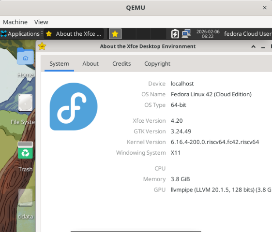
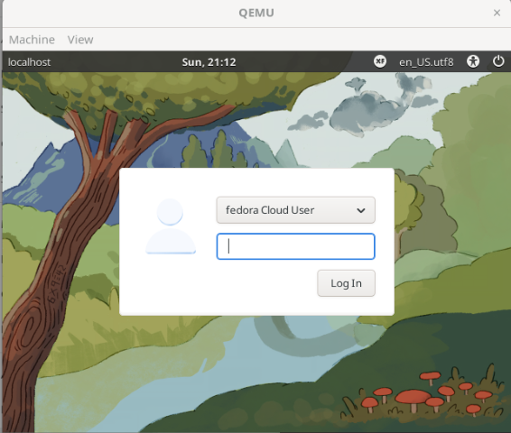

# 在 x86 上安装基于 QEMU 的 Fedora RISC-V 虚拟机，并配置桌面环境

使用环境：Ubuntu 24.04 LTS

由于官网教程使用的是 Fedora 系的 virt-install，并且 cloud-init 配置很麻烦，故写下文说明一个普适的配置流程。

## 准备工作

```shell
sudo apt install qemu-system-misc qemu-utils u-boot-qemu curl genisoimage
```

## 下载镜像

查看 <https://fedoraproject.org/wiki/Architectures/RISC-V/QEMU>，找到你想下载的镜像，复制链接（替换下放），执行：

```
curl -# -o Fedora-42.riscv64.qcow2 https://dl.fedoraproject.org/pub/alt/risc-v/release/42/Cloud/riscv64/images/Fedora-Cloud-Base-Generic-42.20250911-2251ba41cdd3.riscv64.qcow2
```

网络问题可以用 `export https_proxy=http://` 等方式解决。
可选修改保存文件名和验证 sha256。

## resize

下一步是为这个镜像分配足够的硬盘空间。推荐现在做，如果在虚拟机创建好后做，就涉及到手动配置，会麻烦一点。  
由于基本上只用一次，就直接使用 `qemu-img resize Fedora-42.riscv64.qcow2 +10G` 了，如果需要根据这个镜像创建镜像，那可以使用 `qemu-img create -f qcow2 -b base.qcow2 vm.qcow2 8G`

## 准备 cloud-init

Fedora 提供的是 cloud 镜像，目前主流喜欢使用 cloud-init，root 密码等内容并没有配置。  
也就是说想要使用这个镜像的话，要么得对 rootfs 动刀，要么使用 cloud-init 进行自动配置。  
我这里使用一个简化的 cloud-init 配置，如果你想要了解更多，可以查阅文档。

```shell
$ mkdir cloud-init-tmp && cd cloud-init-tmp
$ touch meta-data
$ cat > user-data << EOF
#cloud-config

password: linux
chpasswd:
  expire: false

ssh_authorized_keys:
   - ssh-rsa AAAAB3Nza... # 如果你需要 ssh 登录，请填写这里

runcmd:
  - touch /etc/cloud/cloud-init.disabled

EOF
$ genisoimage -output seedci.iso -volid cidata -joliet -rock user-data meta-data
$ cp seedci.iso ../ && cd ..
```

## 启动虚拟机

启动命令：

```shell
/usr/bin/qemu-system-riscv64 \
    -machine virt -m 4096 -smp 8 \
    -cpu rv64 \
    -kernel /usr/lib/u-boot/qemu-riscv64_smode/uboot.elf \
    -device virtio-net-pci,netdev=eth0 \
    -netdev user,id=eth0,hostfwd=tcp::"2222"-:22 \
    -device virtio-rng-pci \
    -device virtio-vga \
    -device qemu-xhci \
    -serial mon:stdio \
    -usb -device usb-kbd -device usb-tablet \
    -drive file=Fedora-42.riscv64.qcow2,format=qcow2,if=virtio \
    -drive file=seedci.iso,format=raw,if=virtio,readonly=on
```

`-m 4096` 对应内存分配，`-smp 8` 对应 CPU 核心数分配  
如果你在纯终端执行，可以使用 `-nographic` 并去除 `-device virtio-vga`  
如果你需要使用 VNC，可以使用类似 `-nographic -vnc :1`  
如果你需要用完就弃（不修改原始镜像）的虚拟机，可以使用 `-snapshot`  
具体可以参阅 `qemu` 文档。

> 一个奇怪的事情：使用 -cdrom seedci.iso 不行，换成 virtio 好了，但我在另一个环境没有这个问题，可能是 u-boot/qemu 版本问题

如果需要杀掉这个 qemu 进程，不能使用 Ctrl+C，可以在图形界面或者其他终端进行 `killall qemu`

seedci.iso 在系统第一次成功启动完成后可以移除。

> 补充：后面随便问了一下 GPT 如何能让虚拟机模拟得更快，说核心数降低到 1 或 2 更好，可以验证一下，感觉不一定
> `-accel tcg,thread=multi -smp 2` "thread=multi 让多个 vCPU 的翻译可以并行，但收益有限，主要在多核主机上缓解翻译阶段的锁竞争"

## 登入系统

根据官方文档以及我们上面的 cloud-init 配置，使用 用户名: `fedora` 密码: `linux` 即可登入系统。  
我们上方的 qemu 配置还有 2222 -> 22 的端口转发，让我们使用 ssh 登录：

```
$ ssh -p 2222 fedora@localhost
The authenticity of host '[localhost]:2222 ([127.0.0.1]:2222)' can't be established.
ED25519 key fingerprint is SHA256:dp...
This key is not known by any other names.
Are you sure you want to continue connecting (yes/no/[fingerprint])? yes

fedora@localhost: Permission denied (publickey,gssapi-keyex,gssapi-with-mic).
```

看起来 ssh 默认配置只能使用公钥登录。这里我在 qemu 终端里修改 ~/.ssh/authorized_keys，如果你不想遇到这样的麻烦，可以在 cloud-init 阶段就填入自己的公钥。如果不使用 ssh 可以不用填。

> 因为我在虚拟机里面不好复制我就直接手打的 ssh 公钥..还好我的是 ed25519 比较短

于是：

```shell
$ ssh -p 2222 fedora@localhost
Last login: Thu Feb  5 19:43:33 2026
[fedora@localhost ~]$ uname -a
Linux localhost 6.16.4-200.0.riscv64.fc42.riscv64 #1 SMP PREEMPT_DYNAMIC Fri Aug 29 08:42:48 EDT 2025 riscv64 GNU/Linux
[fedora@localhost ~]$ 
```

## 安装图形界面

执行：

```shell
sudo dnf group install xfce-desktop
```

下载完成后会有一段时间输出没有反应，并没有卡死。

然后在终端里（不要在 ssh 里）执行：

```shell
startxfce4
```



我装完之后在重启之后是不会默认进入图形界面的，需要以下设置：

```shell
sudo systemctl set-default graphical.target
```

在重启后，就可以看到进入登录界面了：



## 参考资料

0. 遇到任何问题先读 log 和官方文档而不是找 LLM
1. <https://codeofconnor.com/booting-cloud-images-with-qemu/>
2. <https://colatkinson.site/linux/riscv/2021/01/27/riscv-qemu/>
3. <https://fedoraproject.org/wiki/Architectures/RISC-V/QEMU>
4. ChatGPT/Gemini
