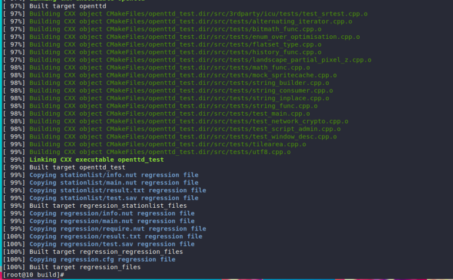
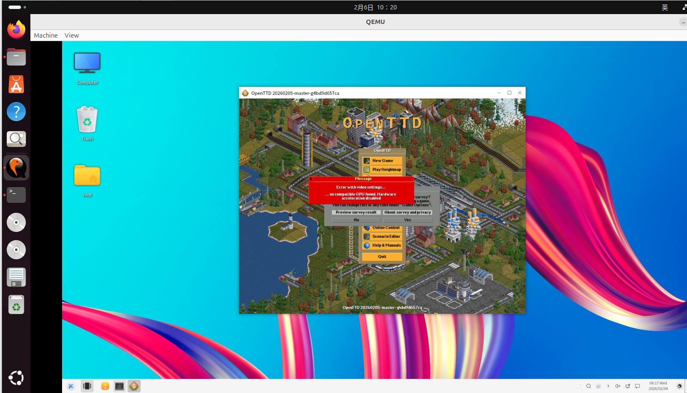

### **在 OpenEuler RISC-V 虚拟机上构建 OpenTTD**

本文档提供了在运行 OpenEuler RISC-V 虚拟机上从源代码构建 `OpenTTD` 的说明。

#### 步骤 1: 获取源代码

从 `OpenTTD` 官方网站获取源码:
```bash
$ git clone https://github.com/OpenTTD/OpenTTD.git
```

#### 步骤 3: 构建OpenTTD

进入到 `OpenTTD` 的源码目录进行编译安装

```bash
$ cd OpenTTD && mkdir build && cd build
$ cmake ..
$ make
```




完成后，可以在当前目录找到 `./OpenTTD` 这个可执行文件

#### 验证

通过命令行运行OpenTTD可执行文件，游戏启动成功。



至此，验证了有效性。
