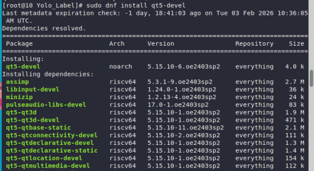
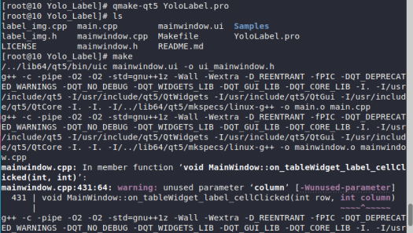
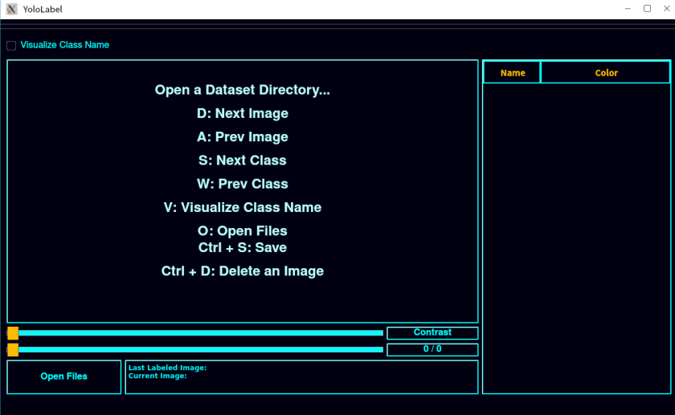
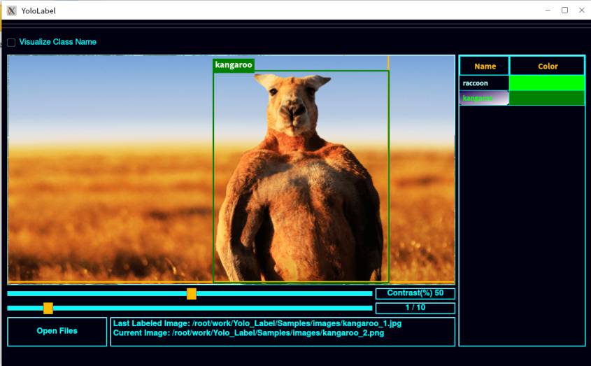
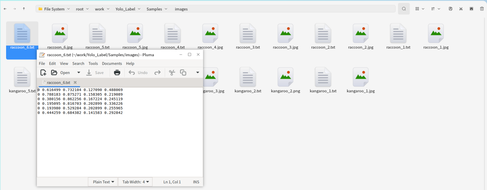

### **在 OpenEuler RISC-V 虚拟机上构建 Yolo_Label**

本文档提供了在运行 OpenEuler RISC-V 虚拟机上从源代码构建 `Yolo_Label` 的说明。

#### 步骤 1: 安装依赖

使用 `dnf` 安装编译所需要的软件包:

```bash
$ sudo dnf update
$ sudo dnf install qt5-devel
```



#### 步骤 2: 获取源代码

从 `Yolo_Label` 官方网站获取源码:
```bash
$ git clone https://github.com/developer0hye/Yolo_Label.git
```

#### 步骤 3: 构建Yolo_Label

进入到 `Yolo_Label` 的源码目录进行编译安装

```bash
$ cd Yolo_Label
$ qmake-qt5 YoloLabel.pro
$ make
```



完成后，可以在当前目录找到 `./YoloLabel` 这个可执行文件

#### 验证

通过命令行运行YoloLabel可执行文件，软件启动成功。



实验标注功能，可以正常使用软件进行标注。





至此，验证了有效性。
