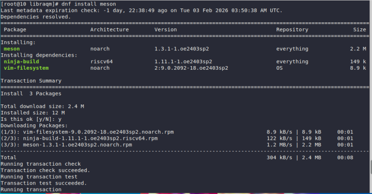
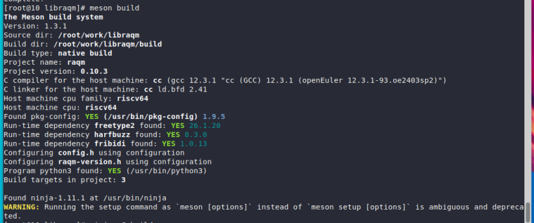
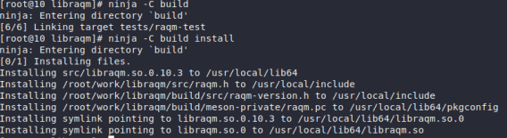
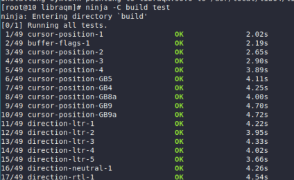
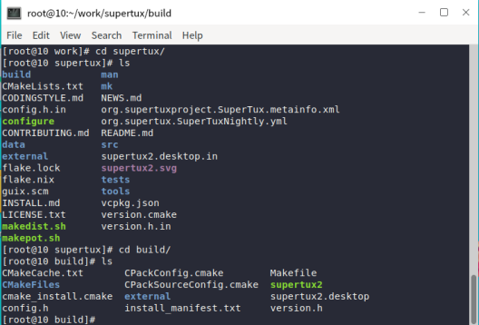
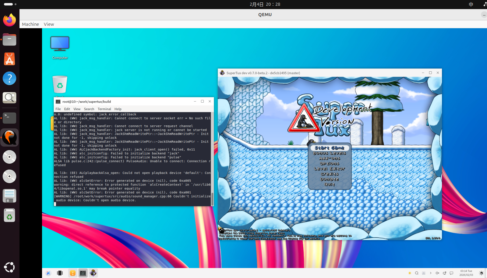

### **在 OpenEuler RISC-V 虚拟机上构建 SuperTux**

本文档提供了在运行 OpenEuler RISC-V 虚拟机上从源代码构建 `SuperTux` 的说明。

#### 步骤 1: 安装依赖

使用 `dnf` 安装编译所需要的软件包:

```bash
$ sudo dnf update
$ sudo dnf install -y cmake gcc-c++ make automake autoconf libtool pkg-config libogg-devel libvorbis-devel openal-soft-devel SDL2-devel freetype-devel curl-devel openssl-devel glew-devel harfbuzz-devel fribidi-devel glm-devel zlib-devel fmt-devel physfs-devel
```

#### 步骤 2: 获取源代码

从 `SuperTux` 官方网站获取源码并初始化子模块:
```bash
$ git clone https://github.com/SuperTux/supertux.git
$ cd supertux
$ git submodule update --init --recursive
```

#### 步骤 3: 获取并编译raqm、SDL2-ttf、SDL2-image

`SuperTux` 还需要raqm、SDL2-ttf、SDL2-image，而fedora未提供，故需要手动编译。

##### 获取raqm

首先安装依赖

```bash
$ sudo dnf install freetype-devel harfbuzz-devel fribidi-devel meson gtk-doc
```

随后获取源码
```bash
$ git clone https://github.com/HOST-Oman/libraqm.git
```

最后按照[官网提示](https://github.com/HOST-Oman/libraqm/blob/main/README.md)进行构建和测试:

```bash
$ meson build
$ ninja -C build
$ ninja -C build install
$ ninja -C build test
```









测试成功即为安装成功。

##### 获取SNL2-image

首先获取源码(需要固定使用2.X版本,SuperTux不兼容3.X版本)
```bash
$ git clone --branch release-2.6.3 https://github.com/libsdl-org/SDL_image.git && cd SDL_image
```

随后构建和安装
```bash
$ mkdir build && cd build
$ cmake ..
$ make
$ sudo make install
$ sudo ldconfig
```

##### 获取SDL2_ttf

首先获取源码(同样需要固定使用2.X版本,SuperTux不兼容3.X版本)
```bash
$ git clone --branch release-2.20.2 https://github.com/libsdl-org/SDL_ttf.git && cd SDL_ttf
```

随后构建和安装
```bash
$ mkdir build && cd build
$ cmake ..
$ make
$ sudo make install
$ sudo ldconfig
```

#### 步骤 4: 构建SuperTux

回到 `SuperTux` 的源码目录进行构建安装

```bash
$ mkdir build && cd build
$ cmake ..
$ cmake --build .
$ cmake --install .
```

完成后，可以在当前目录找到 `./supertux2` 这个可执行文件。

#### 验证

通过命令行运行supertux2可执行文件，游戏界面启动成功。





至此，验证了有效性。
